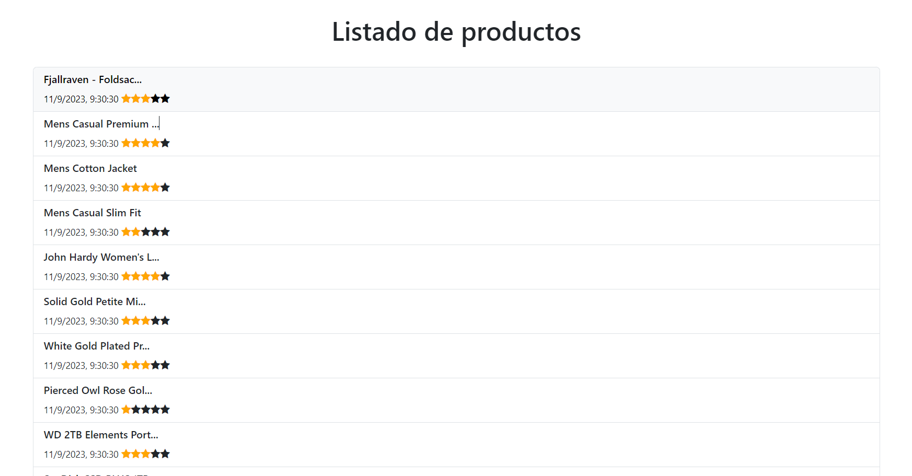

## Ejercicio de semana 12 de Fase 2 JaP: Listado de productos con su calificación en estrellas, fecha y hora de obtención de los mismos

Deberán desarrollar:

- Listar los productos obtenidos de https://fakestoreapi.com/products.
- Mostrar en formato de lista organizado por nombre y clasificación del mismo.
- La clasificación deberá ser representada en formato de estrellas. (<a href="https://www.w3schools.com/howto/howto_css_star_rating.asp">Info</a>)
- Añadir también la fecha y hora en que se obtuvieron los datos. (<a href="https://www.w3schools.com/js/js_dates.asp">Info</a>)
- Y cómo último requerimiento, necesitamos que el título muestre hasta 20 carácteres y luego deje en ...
- Un ejemplo del resultado final:
  

En este ejercicio también haremos énfasis en las buenas prácticas:

- Tener un código modularizado (subdividir una aplicación en partes más pequeñas)
- Nomenclaturas descriptivas y utilizando camelCase
- Utilización de try catch
- Documentación del código clara y concisa

Si terminaste el desarrollo de código, investiga sobre las que no conozcas.
